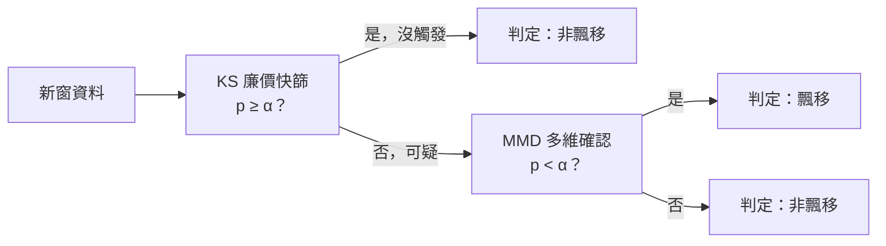
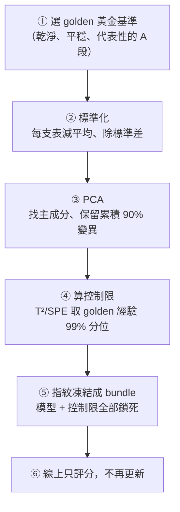
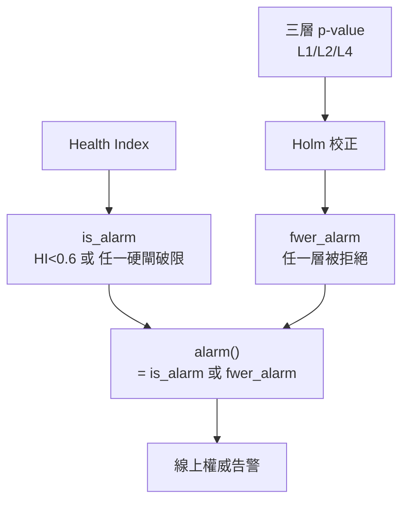

# 演算法白話導讀（給化工工程師）

> 對象：懂連續/批次製程、看得懂單變數管制圖（SPC）、但不熟統計/機器學習的工程師。
> 原則：每個術語第一次出現都用製程情境比喻解釋；本文**只根據 repo 內程式碼**撰寫，不憑記憶。
> 文獻一律以 `docs/literature_crossref.md` 為準；查不到的就標「(文獻待查)」，不捏造。

---

## 0. 一頁速覽

| 你熟悉的東西 | 本系統對應的東西 | 它在抓什麼（一句話） |
|---|---|---|
| 單一儀表的 hi/lo 警報、單變數管制圖 | L1 資料效度閘（DQI_x） | 這筆讀數本身可不可信、操作點有沒有跑出歷史正常範圍 |
| 「各表都正常，產品卻不對」的直覺 | L2 多變量 MSPC（T²/SPE/GSI/RBC） | 每支儀表單看都在規格內，但**儀表之間的關係**已經偏掉 |
| 用易測的製程量去推難測的化驗值（軟測量） | L3 軟測量 Ŷ + 可信帶 | X→Y 的對應關係還成不成立、推估值可不可信 |
| 「這個月的操作分佈跟上個月不一樣」 | L4 campaign 級分佈飄移 | 整段運轉的資料分佈整體搬移了多少 |
| 不同批次的軌跡曲線形狀比對 | L5 批次軌跡 DTW | 同一支批次的時間曲線形狀是否偏離標準批 |
| 一顆綜合健康燈號 | Health Index 0–1 + 告警 | 把上面幾層收斂成一個 0（最差）到 1（最健康）的分數並決定要不要報警 |

---

## 1. 這套系統到底在解什麼問題

### 1.1 情境

同一條產線：跑產品 A → 換線去做 B/C 或停機維修 → **回頭再跑 A**。
問題是：**這次的 A，跟當初那個乾淨的 A 一不一樣？** 有沒有「隱性飄移」？

- 「隱性」＝**每一支感測器單獨看都還在規格內**，傳統單變數管制圖一條線都不會破，可是「多變量關係」或「X→Y 對應」已經悄悄偏了。
- 程式碼把這個「回頭第一段 A」叫 **re-entry**（重新進場），偵測函式在 `health.py:419 detect_reentry_campaigns()`：當某段 grade==A、而它前一段是非 A，就標為 re-entry，這正是最該盯的時刻。
  - 誠實邊界（程式碼註解明載）：目前只抓「**換產品型**」re-entry；「**維修型**」（同樣是 A、中間停機）因為 grade 沒切換，這個函式抓不到，列為待補（`health.py:425` 註解）。

### 1.2 為什麼「單變數看不到、多變量看得到」

化工比喻：反應器有「進料流量」和「夾套冷卻水流量」兩支表。正常運轉時這兩者**綁在一起連動**——進料多、冷卻水就得跟著多。

- 假設今天進料 50%、冷卻水 50%，兩支表單看都在 40–60% 規格內，**單變數管制圖全綠**。
- 但如果正常時「進料 50% 應該配冷卻水 70%」，現在卻只給 50%，**兩支表的相對關係斷了**。產品可能已經偏了，可是沒有任何一支表破限。

單變數管制圖一次只看一根軸，永遠看不到「軸與軸之間的夾角變了」。
多變量方法（下面的 L2）會先學會「正常時各表之間該長什麼關係」，再看新資料**有沒有偏離這個關係面**——這就是本系統存在的理由（`mspc.py` 開頭 docstring 明寫「這正是本 index 存在的理由」）。

---

## 2. 判斷鏈 L1–L5 逐層白話

判斷鏈設計成 MECE（互斥、不重疊、合起來涵蓋所有失效方向），每層抓一種「壞法」。

| 層 | 名稱 | 化工比喻 | 它在抓什麼 | 程式位置 |
|---|---|---|---|---|
| **L1** | 資料效度閘（DQI_x） | 先確認「儀表本身沒壞、讀數可信」再往下判 | NaN、卡死（DCS freeze）、超物理界限、操作點離歷史中心太遠 | `detectors/dqi_x.py` |
| **L2** | 多變量 MSPC | 「各表都正常但產品不對」的數學版 | 變數之間的相關結構被破壞（隱性飄移主力） | `detectors/mspc.py` |
| **L3** | 軟測量 Ŷ + 可信度 | 用製程量推化驗值，並標「這次推估可不可信」 | X→Y 對應關係斷裂、推估值落在可信帶外 | `detectors/soft_sensor.py` |
| **L4** | campaign 級分佈飄移 | 「這個月跟上個月的操作分佈不一樣」 | 整段運轉的資料分佈整體位移 | `detectors/drift.py` |
| **L5** | 批次軌跡 DTW | 不同批的曲線形狀比對 | 批次時間軌跡形狀偏離標準批 | `detectors/batch_dtw.py` |

> 重要的層分離（`dqi_x.py:17` 註解明載）：L1 只量「主成分子空間內的距離」，**正交方向的偏移它抓不到**，那是 L2 SPE 的職責。所以乾淨性最終靠 L2 + L4 把關，不靠 L1 一層。

---

## 3. 核心統計量（每個：比喻 → 直覺 → 公式 → 抓什麼 → 對應門檻）

先講三個共用的前置動作（程式碼裡每個偵測器 `fit()` 都會做）：

1. **標準化**：每支表減平均、除標準差，把「流量 0–100 t/h」和「溫度 0–400°C」拉到同一把尺，不然數字大的表會主宰一切。（`mspc.py:36`、`dqi_x.py:99`）
2. **PCA（主成分分析）**：化工比喻——一座精餾塔幾十個塔板溫度其實高度連動，真正獨立變動的「自由度」沒幾個。PCA 就是找出這幾個「主旋律方向」（主成分）。程式保留累積解釋到 90% 變異的成分數（`config.pca_var_explained = 0.90`，`mspc.py:45`）。
3. **凍結基準**：在乾淨的 golden-A 上把模型和控制限算好就**鎖死**，之後只拿來評分，不再隨線上資料偷偷更新（`interface.py:15` 不變式）。

### 3.1 T²（Hotelling T²）

- **化工比喻**：在「正常操作雲」裡，量你現在這個操作點離雲的**中心**有多遠——但不是直線距離，而是**順著資料自然散佈的形狀**去量。沿著資料本來就會擺動的方向走遠一點不算數，往資料平常不太動的方向偏一點就很顯眼。這種「考慮散佈形狀」的距離叫 **Mahalanobis 距離（馬氏距離）**。
- **直覺**：操作點還在不在「正常操作中心」附近。
- **公式**（`mspc.py:58 t2()`，保留 k 個主成分子空間內）：

$$T^2 = \sum_{i=1}^{k} \frac{t_i^2}{\lambda_i}$$

其中 $t_i$ 是樣本投影到第 i 個主成分的分數，$\lambda_i$ 是該主成分的變異量（除以它＝沿擺動大的方向放寬、擺動小的方向收緊）。

- **它在抓什麼**：操作點整體有沒有跑掉、偏離正常操作中心。
- **對應門檻**：`config.mspc_alpha = 0.01`。控制限取 golden-A 上 T² 的**經驗 99% 分位**（`mspc.py:51`），即「正常時 100 次只有 1 次會超過這條線」。刻意用經驗分位、不套 F/χ² 公式，因為那些公式假設資料是高斯分佈，化工資料未必成立（`mspc.py:13` 註解）。

### 3.2 SPE / Q（殘差平方和，隱性飄移主力）

- **化工比喻**：PCA 學到「正常時各表該躺在哪個關係面（流形）上」。SPE 量的是你這個點**離開那個面有多高**——就是 §1.2「進料 50% 卻只配冷卻水 50%」那種「關係斷掉」的偏離量。T² 是「在面上跑多遠」，SPE 是「離開面多高」，兩者互補。
- **直覺**：變數**之間的相關結構**被破壞了多少。這正是隱性飄移（每支表都在規格內、只有關係偏）會現形的地方。
- **公式**（`mspc.py:63 spe()`）：把樣本投影到 PCA 模型平面得到重建 $\hat{x}$，殘差就是離面的部分：

$$\text{SPE} = \lVert x - \hat{x} \rVert^2 = \lVert \tilde{C}\,x_s \rVert^2,\quad \tilde{C} = I - P_k P_k^\top$$

$\tilde{C}$ 是「殘差投影」矩陣，把點打到「PCA 模型沒解釋到的方向」上；$x_s$ 是標準化後的樣本。

- **它在抓什麼**：每支表單看都正常、但儀表間關係已偏的**隱性多變量飄移**——單變數 SPC 完全看不到，SPE 升起。
- **對應門檻**：同樣 `config.mspc_alpha = 0.01`，控制限取 golden-A 上 SPE 的經驗 99% 分位（`mspc.py:52`）。
- 在融合層裡，SPE 是 L2 健康子分數的來源，而且融合權重特別加重（見 §6，`fusion_weights = (1, 2, 1)`，L2 權重 2）。

### 3.3 GSI（Global Similarity Index，全域相似度）

- **化工比喻**：AVM（自動虛擬量測，半導體界做軟測量的系統）裡的「整體相似度閘」——把當下這筆製程資料拿去跟「建模用的全部歷史資料」比整體相似度，本質也是一種馬氏距離。
- **公式**（`mspc.py:68 gsi()`）：用**全部** p 個方向（不只前 k 個主成分）算馬氏距離平方，再除以維度 p：

$$\text{GSI} = \frac{D^2}{p} = \frac{1}{p}\sum_{i=1}^{p}\frac{t_i^2}{\lambda_i}$$

- **它在抓什麼**：操作點與整段建模歷史的整體相似度（越大越不像）。
- **重要警告（程式碼明載，Rule 12 誠實標）**：GSI 用到**全部**方向，包含那些變異近乎 0 的方向（$\lambda_i \approx 0$），除以接近 0 會數值爆走、不穩。所以本系統**以 T²+SPE 為主力，GSI 只當 AVM 相容對照**，並對 $\lambda$ 加下限避免除爆（`mspc.py:7-9` 註解）。`confidence()` 也刻意用穩健的 T² 而非 GSI（`health.py:159`）。
- **文獻**：GSI 原始定義出自 Cheng et al. 2008（IEEE T-SM 21(1):92–103），`literature_crossref.md` 已 VERIFIED。

### 3.4 RBC（Reconstruction-Based Contribution，肇因歸因：哪支表害的）

- **化工比喻**：警報響了之後，你要知道**到底哪支表（哪個製程參數）造成異常**，才能去現場處理。RBC 就是把 SPE 這個總偏離量「拆帳」到每一支表頭上。
- **為什麼不用最樸素的 contribution**：傳統「貢獻圖」有個毛病叫 **smearing（塗抹）**——一支表真的壞了，會把帳算到旁邊無辜的表上，誤導維修。RBC 用「反推重建」的方式把這種塗抹消掉。
- **公式**（`mspc.py:74 rbc_spe()`，逐樣本逐變數）：

$$\text{RBC}_j^{\text{SPE}} = \frac{e_j^2}{\tilde{C}_{jj}}$$

$e_j$ 是第 j 支表的殘差，$\tilde{C}_{jj}$ 是殘差投影矩陣的對角元素。

- **它在抓什麼**：對 SPE 異常，定位**哪幾支製程參數**貢獻最大（給維修當線索）。
- **誠實邊界（程式碼明載）**：RBC 是「**定位**，非因果」——多個方向同時漂移時 RBC 仍會殘留一些塗抹（`mspc.py:12` 紅隊 H3 註記）。也就是它告訴你「先去看這幾支表」，但不保證那就是根因。
- **文獻**：Alcala & Qin 2009, *Automatica* 45(7):1593–1600（程式碼 docstring 引用）。註：此筆未列在 `literature_crossref.md` 主表中（該表收的是 AVM/MSPC 跨域對照），**RBC 出處待回填查證 (文獻待查)**。

### 3.5 軟測量（virtual metrology / soft sensor）：用 X 算 Ŷ + 可信帶

- **化工比喻**：化驗品質（Y，例如純度、濃度）很貴又慢、甚至要破壞性取樣。軟測量＝用便宜又即時的製程量（X，溫度/流量/壓力）**推估**那個化驗值 Ŷ，取代部分抽樣。這正是 AVM 的初衷（`soft_sensor.py:1` docstring）。
- **怎麼建**（`soft_sensor.py`）：在 golden-A 的 (X, Y) 上訓練一個迴歸模型，只用「Y 真的有量到」的那些列。系統提供兩種底模，由資料規模自動選（`make_soft_sensor()`，`soft_sensor.py:186`）：

| 底模 | 何時選 | 化工白話 |
|---|---|---|
| **GPR**（高斯過程迴歸） | 小資料、低維（預設） | 小樣本下能抓非線性、還會附「這次推估有多不確定」 |
| **PLS**（偏最小平方） | 高維（X 維 > 30）或大資料（n > 1000） | 製程變數高度共線（很多表連動）時穩健、算得快 |

- **可信帶（conformal，符合性預測）**：化工比喻——軟測量給你一個 Ŷ，但你會想知道「這個推估值±多少之內可信」。系統不用沒保證的拍腦袋誤差帶，而是用 **split-Conformal Prediction**：拿一批「沒參與訓練」的校準資料，看模型在上面犯的誤差有多大，據此給出一個**有覆蓋率保證**的區間——白話：「真值落在這個帶內的機率 ≥ 90%」（`config.cp_alpha = 0.10`，即目標覆蓋 90%；`soft_sensor.py:107 predict_interval()`）。

  $$\hat{C}(x) = [\,\hat{y}(x) - q,\; \hat{y}(x) + q\,],\quad q = \text{校準殘差的第 } k \text{ 小值}$$

  其中 $k = \lceil (n+1)(1-\alpha) \rceil$（`soft_sensor.py:95`）。

- **可信帶不可用時的退路（誠實標）**：校準樣本不足（< `cp_min_calibration = 200`），或 α 太小導致需要無限寬區間時，CP **不啟用**（`cp_available=False`），上層改用 L1 的 GSI/域相似度當可信度依據（`soft_sensor.py:79` docstring）。系統寧可說「這次無法給保證」也不靜默近似。

- **map_health（X→Y 關係還成不成立）**（`y_health.py:73`）：把窗內有量到的實際 Y 跟軟測量 Ŷ 比，看殘差**有沒有超出可信帶**。帶內＝關係正常（健康=1）；超帶越多、健康越低（exp 衰減）。

  $$\text{excess} = \overline{\max\!\left(0,\; \frac{|y - \hat{y}|}{\text{band}} - 1\right)},\qquad \text{map\_health} = e^{-\text{excess}/\text{scale}}$$

  - **它在抓什麼**：一種特別陰險的飄移——「Y 的邊際分佈看起來沒變，但 X→Y 的對應關係已經斷了」（`y_health.py:5`）。也就是品質數字表面正常，但「給定這組製程條件**本該**得到的品質」已經對不上。
  - 窗內 Y 觀測數 < `y_map_min_obs = 5` 就回 `None`（不可靠就不算，不假裝有答案）。

### 3.6 分佈飄移（L4：整段資料分佈搬移了多少）

L4 不看單點，而是把**整段（一個 campaign / 一個窗）**的資料分佈，跟 golden 的分佈整體比對。全部在 **PCA 分數空間**做（先把變數去相關，這樣每一維的一維檢定才有意義；`drift.py:4`）。

#### Wasserstein 距離（搬土距離）

- **化工比喻**：想像 golden 的資料分佈是一堆沙、新資料的分佈是另一堆沙形狀。**要把第一堆沙搬成第二堆的形狀，最少要搬多少土、搬多遠**——這個「總搬運工作量」就是 Wasserstein 距離。分佈整體平移得越多，要搬的土越多，距離越大。
- **它在抓什麼**：分佈的**整體位移量級**（例如換產品後操作點整批搬家）。
- **程式重點**（`drift.py:167 wasserstein_magnitude()`）：算出來會**對 golden 自己的正常波動標準化成 z 分數**，這樣不同段之間才能公平比較（否則樣本數不同會讓數字亂跳）。回傳的 z 越大＝搬得越遠。
- **對應參數**：`config.w_null_reps = 50`（建正常基準的重抽次數）、`config.drift_scale = 5.0`（z 轉成健康子分數的衰減尺度，見 §6）。

#### KS 檢定（Kolmogorov–Smirnov，廉價先篩）

- **化工比喻**：每一維單獨比「兩條累積分佈曲線最大差多少」，是個便宜的快篩，發現可疑才升級到更貴的檢定。
- **它在抓什麼**：任一維的邊際分佈有沒有明顯不同（first-pass 哨兵）。
- **程式重點**（`drift.py:118 ks_min_pvalue()`）：對每一維各做一次 KS，取最小 p-value，並做 **Bonferroni 校正**（乘以維度數）——因為「比的維度越多，純靠運氣撞到一個顯著」的機會越高，校正避免假警報。對應 `config.ks_alpha = 0.01`。

  > p-value（白話）：假設「其實沒飄移」的前提下，看到眼前這麼大差異的機率。p 很小＝「沒飄移」這個假設站不住腳＝判定有飄移。

#### MMD（Maximum Mean Discrepancy，最大平均差異）

- **化工比喻**：KS 一次只看一根軸；MMD 是**多維一起比**兩堆資料「整體長得像不像」的距離。KS 快篩覺得可疑時，再用 MMD 多維確認。
- **它在抓什麼**：多維聯合分佈的整體差異（KS 觸發後的確認關卡）。
- **程式重點**（`drift.py:101 _mmd2()`、`drift.py:125 mmd_pvalue()`）：用 RBF 核（bandwidth 取 golden 內配對距離中位數），靠**重排檢定**（permutation）算 p-value——把兩堆資料混在一起反覆隨機洗牌，看「隨機洗出來的差異」有多少次比實際差異還大，以此判斷實際差異是不是真的。
- **PSI**（Population Stability Index）：另一個分箱比對指標，但程式碼明確標「**僅供溝通、不參與顯著性決策**」（資料點少時脆弱，`drift.py:8`）。

### 3.7 DTW（Dynamic Time Warping，動態時間規整／批次軌跡對齊，L5）

> 此段只在**批次製程**（如 penicillin/IndPenSim 發酵）有意義；連續穩態製程不適用。

- **化工比喻**：發酵批次每批的時間曲線（溫度、溶氧、菌體濃度隨時間的軌跡）長度都不一樣（IndPenSim 每批 835–1450 點），而且**相位**會漂——同一個發酵階段，這批進展快、那批進展慢。你想比「這批的曲線**形狀**跟標準批像不像」，但不能硬把時間軸對齊硬減，否則相位差一點就誤判。DTW 就是一種「**容許時間軸局部伸縮**」的曲線比對：它會幫兩條曲線找出最省力的對齊方式，再算對齊後的形變距離。
- **直覺**：兩批的軌跡形狀差多少（已扣掉「純粹快慢不同」造成的假差異）。
- **程式重點**（`detectors/batch_dtw.py`）：
  1. 先把每批**降採樣到固定點數**（`dtw_resample_len=100`）對齊長度（`_prep()`，`batch_dtw.py:38`）。
  2. 再用 **Sakoe-Chiba band 限制的 DTW** 算對齊距離——band（`dtw_band=0.15`）限制時間軸最多能伸縮多少，同時把 O(n²) 成本壓下來（FastDTW 精神，Rule 6 成本上限；`batch_dtw.py:48`）。
  3. 門檻用**正常參考批的 leave-one-out 內部距離**校準：`threshold_ = LOO 距離 mean + k·std`（`dtw_threshold_k=2.0`，k=2 ≈ 5% 正常誤報；`batch_dtw.py:71`）。
- **它在抓什麼**：整段批次軌跡的**全域形狀偏移**。
- **誠實邊界（程式碼明載）**：
  - 「長度不一」其實降採樣就解決了；DTW **額外**買到的是「相位漂移容忍」——某發酵階段快慢不一時 DTW 嚴格優於降採樣後直接相減，但在目前 IndPenSim 上 DTW 的邊際增益**尚未在此資料證實**，屬防禦性選擇（`batch_dtw.py:7`）。
  - 只偵測「**全域**軌跡形變」；局部/瞬時擾動型 fault 可能漏，所以只宣稱「faulty 批旗標率明顯高於正常」，不誇大成 100%（`batch_dtw.py:15`）。
  - 門檻校準前提：參考批必須**同質**（同 recipe 段，如 IndPenSim batch 1–20）；跨模態的參考批內部變異會抬高門檻、降低靈敏度（`batch_dtw.py:17`）。
- **文獻**：批次軌跡對齊在 `literature_crossref.md` 維度 4 有對照——半導體側 Owens, Sun et al. 2024（SEMI ASMC，DTW+recipe constraint，VERIFIED）；化工原生對應 Nomikos & MacGregor 的 MPCA 與 COW（correlation optimised warping，VERIFIED）。

#### L4 的兩段式決策（`drift.py:215 is_drift()`）

先用便宜的 KS 篩，觸發才花錢跑 MMD，**兩關都顯著才判飄移**。這是成本分層（Rule 6 線上運算成本上限）。

---

## 4. 模型怎麼建立（指紋凍結流程）

所有偵測器都遵循同一套「在乾淨基準上學好就鎖死」的流程：

- **① 選 golden**：可手動指定，也可 `golden='auto'` 自動挑——切段後濾掉太短的段（`golden_auto_min_frac = 0.12`）、並排除段內還在爬坡/漸變的不平穩段（`golden_auto_ramp_max = 0.5`），確保拿到的是乾淨平穩的基準（`config.py:41`）。
- **⑤ 凍結 bundle**：`HealthIndex.fit()`（`health.py:40`）一次把 L1（DQIxGate）、L2（MSPCModel）、L4（DriftDetector）都 fit 好並凍結，連 golden 的 per-sample 基準（DQI/SPE/T² 的平均與標準差）都一起存，供之後算「不飽和嚴重度」用。

### 只監控部分製程參數（特徵子集）

系統不強制用上全部的表。你可以只挑你關心的、或已知會飄的**製程參數子集**來建模（程式裡 X 欄名由 `interface.py` 的 `x_columns` 契約宣告，至少要 ≥2 維才能談「多變量關係」）。挑得少＝模型更聚焦、算得快；挑得多＝覆蓋更廣但對雜訊更敏感。

---

## 5. 怎麼監控兩種飄移

系統把「飄移」拆成兩條正交的線：**製程參數 X 側** 和 **品質標的 Y 側**。

### 5.1 X 側：製程參數多變量飄移

就是 §3 的 L1/L2/L4——只看製程量 X 之間的關係與分佈有沒有偏。**不需要化驗值 Y**，所以隨時都能算。隱性飄移的主力訊號在 **L2 SPE**（關係斷裂）。

### 5.2 Y 側：品質標的飄移（`y_health.py`，增量 8/9）

Y 可以從**兩個獨立方向**變壞，各看一個就會漏，所以要分開抓再融合（`y_health.py:9` 第一性原理）：

| Y 健康分量 | 化工比喻 | 它在抓什麼 | 程式 | 何時可算 |
|---|---|---|---|---|
| **map（映射健康）** | 「給這組製程條件，本該得到的品質」對不上了 | X→Y 關係斷裂（Ŷ 偏離實際 Y，但 Y 邊際分佈可能沒變） | `map_health()` `y_health.py:73` | 窗內 Y 觀測 ≥ `y_map_min_obs=5` |
| **dist（分佈健康）** | 品質本身的分佈整批搬家（換產品 G/H 比例變了） | 多維品質 Y 的分佈位移（用 Y 側的 T²/SPE 算異常率） | `dist_health()` `y_health.py:90` | 有多維品質（q≥2），純量品質無此分量 |

另外還有第三條「半隱性」路（增量 8，在 `deploy/demo.py:307` 接線）：

- **Ŷ 水準漂移**：就算窗內**完全沒有量到實際 Y**，也能用「軟測量推估值 Ŷ 的窗均值」跟 golden 期的 Ŷ 基準比，算一個 z 分數。超過 `config.y_trend_z_max = 3.0`（3σ，就是 SPC 的 3 倍標準差規則）就標品質飄移旗標（`demo.py:318`）。白話：「機台推估出來的品質水準，整體偏離了當初的正常水準」。

**Y 側決策雙軌**（`y_health.py:12`）：

- `y_health()`：可用分量的**加權平均**梯度分數（資訊性，0–1）。
- `y_flagged()`：**任一可用分量 < `y_flag_threshold=0.5`** 就亮旗（安全網）——防止「一個分量崩了、卻被另一個健康分量平均稀釋掉」而漏報（`y_health.py:124`，紅隊 A1）。

#### Y 量測稀疏時的偵測邊界（誠實標，Rule 12）

化工現實：化驗值常常很稀疏（幾小時甚至一天才一筆）。程式碼明確標了邊界：

- 窗內 Y 觀測 < 5 筆 → `map_health` 回 `None`（不可靠就不算，不補 0 假裝有答案，`y_health.py:81`）。
- 完全沒有可用分量（窗內無足夠 Y 且無多維品質）→ `y_health()` 直接 `raise`，不回假值（`y_health.py:120`）。
- 但即使 Y 全缺，**Ŷ 水準漂移那條路仍能跑**（只需 X 就能推 Ŷ），這是 Y 稀疏時的兜底偵測。
- CP 可信帶在「校準樣本剛好跨過 200 門檻」時帶寬會跳變（±約 39%），導致 map_health 同步跳變（`y_health.py:64` 紅隊 A2，誠實標為已知離散性）。

---

## 6. Health Index 0–1 與告警

### 6.1 三層融合成一個分數

把 L1/L2/L4 各算成一個 0–1 子分數（**統一方向：越高越健康**），再加權平均（`health.py:148 health_index()`）。

- **子分數怎麼算（不飽和嚴重度）**（`health.py:118 _severity_health()`）：對每個樣本，先算它的統計量（DQI 或 SPE）偏離 golden 平均幾個標準差（z），再轉成健康分 $e^{-z/\text{scale}}$，最後對窗取平均。

  $$\text{子分數} = \overline{\exp\!\left(-\frac{\max(z,0)}{\text{scale}}\right)},\quad z = \frac{\text{統計量} - \mu_{\text{golden}}}{\sigma_{\text{golden}}}$$

  - 為什麼這樣設計：早期版本用「超控制限的樣本比例」，但**弱的隱性飄移**下多數樣本還沒破限，比例會卡在高位、漏報。改成逐樣本標準化後，「微弱但一致的整體抬高」也會讓每個樣本健康同步下滑，窗均值單調反映出來（`health.py:124` 註解）。`fusion_severity_scale = 3.0`：偏離 3σ → 健康≈0.37。
  - **誠實邊界**：這個標準化在**強自相關**資料（連續 TEP，相鄰時刻高度相關）上會**低估窗級波動**，使 P1 融合對真實連續製程的隱性飄移**窗級鑑別力弱**（`health.py:126` 實測 recall≈0）；該訊號改由 `fwer_alarm` 的 window-vs-window 方法扛起。

- **融合權重**：`config.fusion_weights = (1.0, 2.0, 1.0)`（L1, L2, L4）。**L2 權重 2**，因為 SPE 是隱性飄移的主訊號，刻意加重（`config.py:88`）。

  $$\text{HI} = \frac{1\cdot s_{L1} + 2\cdot s_{L2} + 1\cdot s_{L4}}{1+2+1}$$

### 6.2 confidence（這次告警可不可信）

`confidence()`（`health.py:153`）回答的是「**Health Index 這個判讀本身可不可信**」，跟 HI 高低是**兩條不同的軸**：

- 它量的是 **T² 操作域相似度**——你現在的操作點，落不落在當初建模 golden 的「正常操作包絡」內。
- 落在包絡內（T²≈golden）→ HI 是**內插**、可信；落在包絡外（T²≫golden）→ HI 是**外推**、判讀要保留。
- 關鍵互補（程式碼實證）：**隱性飄移**＝關係斷了、但操作點還在包絡內 → **HI 低、但 confidence 高** ＝「**一個可信的告警**」（真的偵測到離流形，不是外推瞎猜）；反之操作點大幅外移 → confidence 低 ＝判讀為外推、保留。
- 注意：confidence 用穩健的 T²，**不是** GSI（GSI 數值不穩），也刻意不沿用 AVM 的 RI 名稱與雙模型法（`health.py:159`，紅隊 H1/C3 已用 conformal 取代 RI）。

### 6.3 何時開告警（雙軌 + 單一出口）

系統有兩套告警邏輯並存，語義不同：

| 告警 | 邏輯 | 化工比喻 | 程式 |
|---|---|---|---|
| **is_alarm**（H8 雙軌安全網） | HI < 門檻 **或** 任一單層硬閘破限 | 「綜合燈號太低，**或**任一關鍵指標單獨爆表」就報 | `health.py:223` |
| **fwer_alarm**（AC-6 嚴格） | 三層 p-value 經 Holm 校正，任一拒絕虛無即報 | 「統計上嚴格控制誤報率」的版本，golden 期誤報率 ≤ α | `health.py:349` |

- **硬閘（hard gates）**（`health.py:215`）：防止「一個致命破壞被融合平均稀釋掉」。任一層嚴重破限就直接亮（L1 過半樣本離域 / L2 過半樣本異常 / L4 判定飄移）。
- **門檻**：`config.hi_alarm_threshold = 0.6`（HI < 0.6 就告警）。
- **Holm 校正**（`health.py:403 _holm_reject()`）：化工比喻——你同時看 3 個指標，「純靠運氣有一個顯著」的機會比看 1 個高。Holm 是個逐步收緊的多重比較校正，保證「就算其實全部正常，誤報的整體機率 ≤ α（`fwer_alpha = 0.05`）」。
- **單一權威出口 `alarm()`**（`health.py:365`）：線上判決走這裡，等於 `is_alarm` **或** `fwer_alarm` 的聯集——最弱的飄移（強度 ≲0.3）由 fwer 那條腿補上。若 fwer 計算失敗會退回 is_alarm 並 warn（fail-safe，不讓線上判決崩）。

---

## 附錄：參數速查（config.py）

| 參數 | 預設 | 白話意義 | 章節 |
|---|---|---|---|
| `pca_var_explained` | 0.90 | PCA 保留到累積 90% 變異 | §3 前置 |
| `mspc_alpha` | 0.01 | T²/SPE 控制限取 golden 99% 分位（100 次容 1 次） | §3.1/3.2 |
| `cp_alpha` | 0.10 | 軟測量可信帶目標覆蓋 90% | §3.5 |
| `cp_min_calibration` | 200 | CP 上線最少校準樣本，不足退 GSI | §3.5 |
| `y_map_min_obs` | 5 | map_health 最少 Y 觀測，不足回 None | §5.2 |
| `y_flag_threshold` | 0.5 | 任一 Y 分量低於此就亮旗 | §5.2 |
| `y_trend_z_max` | 3.0 | Ŷ 水準漂移超 3σ 標旗 | §5.2 |
| `drift_window` | 60 | L4 飄移偵測窗大小 | §3.6 |
| `ks_alpha` | 0.01 | KS 快篩顯著水準 | §3.6 |
| `fusion_severity_scale` | 3.0 | L1/L2 嚴重度→健康的衰減尺度（3σ→≈0.37） | §6.1 |
| `drift_scale` | 5.0 | L4 z→健康子分數衰減尺度 | §6.1 |
| `hi_alarm_threshold` | 0.6 | HI < 0.6 告警 | §6.3 |
| `fusion_weights` | (1,2,1) | L1/L2/L4 融合權重（L2 加重） | §6.1 |
| `fwer_alpha` | 0.05 | 嚴格告警的族系誤報率上限 | §6.3 |

---

## 待查 / 待確認清單

- **(文獻待查) RBC 出處**：程式碼 `mspc.py:10` 引用 Alcala & Qin 2009, *Automatica* 45(7):1593–1600，但此筆**未列於** `docs/literature_crossref.md` 主查證表，未經本專案獨立查證，引用前應回填確認。
- **(已知邊界，非待查)** 以下皆為**程式碼自己誠實標記**的邊界，非捏造：連續強自相關資料下 P1 融合的窗級鑑別力弱（`health.py:126`）、維修型 re-entry 尚未實作（`health.py:425`）、L5 DTW 在 IndPenSim 上邊際增益未證實且只偵測全域軌跡形變（`batch_dtw.py:7,15`）、CP 帶寬在校準門檻附近跳變（`y_health.py:64`）。
