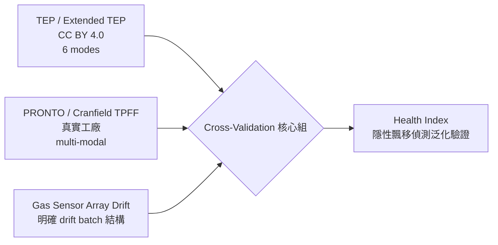

# 連續型製程開源資料集調查 — TEP 之外的 cross-validation 候選

> 目的：在 Tennessee Eastman Process (TEP) 之外，建立「連續型製程參數監控／故障偵測／隱性飄移偵測」的多資料集 cross-validation 組，避免單一資料集過擬合。
> 適配場景：grade A → 換 B/C 或停機維修 → 回到 A，偵測 A 的隱性多變量飄移（每變數在規格內但 multivariate 關係偏移）。
> 評估維度權重：**連續型 + 多變量 + 有 ground-truth + 有 multimode/grade 結構 + 開放授權**。
> 嚴禁捏造：每筆附真實 URL + 授權 + 代表文獻 DOI；查不到標 NOT FOUND。調查日 2026-06-01。

---

## 適配評分準則（★1-5）

| ★ | 含義 |
|---|---|
| ★5 | 連續 + 多變量 + 明確 multimode/grade 切換 + 有 ground-truth + 開放授權，幾乎直接對應 re-entry drift 場景 |
| ★4 | 連續 + 多變量 + ground-truth，multimode 部分滿足或需自行建構 grade 切換 |
| ★3 | 連續多變量 + ground-truth，但無 multimode（只能驗 L1-L3，無法驗 campaign 切換語意） |
| ★2 | 連續多變量但 ground-truth 為 attack/anomaly 性質，與「規格內隱性飄移」語意偏離，僅壓力測試用 |
| ★1 | 批次/離散/單變數性質，僅作邊緣參照 |

---

## 總表

| 名稱 | 連續/批次 | #變數 | 取樣率 | ground-truth 型態 | multimode/grade | 下載 URL | 授權 | 格式 | 代表文獻 + DOI | 適配 |
|---|---|---|---|---|---|---|---|---|---|---|
| **Extended TEP (Reinartz 2021)** | 連續 | 52 (41 量測 + 11 操作，含 19 品質指標) | 3 min | 28 process faults × 6 modes，含 setpoint change / mode transition | ✅ **6 production modes + mode transition** | https://data.dtu.dk/articles/dataset/Tennessee_Eastman_Reference_Data_for_Fault-Detection_and_Decision_Support_Systems/13385936 | CC BY 4.0 | CSV/RData | Reinartz, Kulahci, Ravn (2021) Comput. Chem. Eng. 149:107281, DOI 10.1016/j.compchemeng.2021.107281；資料集 DOI 10.11583/DTU.13385936.v1 | ★5 |
| **pyTEP (Reinartz 2022 生成器)** | 連續 | 同 TEP 52 | 可調 | 自生 fault + mode 切換腳本 | ✅ 可程式化生成 mode transition | https://github.com/ccreinartz11/pytep | BSD-3-Clause | Python API | Reinartz, Enevoldsen (2022) SoftwareX 18:101053, DOI 10.1016/j.softx.2022.101053 | ★5（生成器，非靜態集）|
| **Cranfield Three-Phase Flow Facility (TPFF)** | 連續（真實工廠）| 24 | 1 Hz | normal + 6 seeded faults | ⚠️ 多組 flow 操作點，但非 grade 語意 | Kaggle: https://www.kaggle.com/datasets/afrniomelo/cranfield ；CORE PDF: https://files01.core.ac.uk/download/pdf/74410143.pdf | 學術 benchmark（Kaggle 鏡像未標準授權，引用原文）| CSV/Excel | Ruiz-Cárcel et al. (2015) Control Eng. Pract. 42:74-88, DOI 10.1016/j.conengprac.2015.04.012 | ★4 |
| **PRONTO heterogeneous benchmark (同 TPFF 升級)** | 連續（真實工廠）| 多源（process + 高頻 ultrasonic + alarm + log + video）| multi-rate | normal + induced faults（air/water/slugging）| ✅ **多 operational condition (multi-modal)** | https://zenodo.org/records/1341583 | CC BY 4.0 | ZIP（1.7 GB，含原始 4.9 TB）| Stief et al. (2019) J. Process Control 79:41-55, DOI 10.1016/j.jprocont.2019.04.009；資料集 DOI 10.5281/zenodo.1341583 | ★4 |
| **HSSED 蒸餾塔資料集** | 連續 | 39（液位/流量/溫度/壓力/純度）| 時序 | normal + 25 faults × 4 severity = 100 場景 | ⚠️ severity 階層，無顯式 grade | 見代表文獻附 supplementary（ResearchGate 條目）| 開源（論文宣稱 open-source）| 時序 CSV | "An open-source dataset of heat-integrated side-stream extractive distillation process..."（2025，ResearchGate 395833321）— **DOI NOT FOUND（待補正式期刊 DOI）** | ★3 |
| **UCI Condition Monitoring of Hydraulic Systems** | 準連續（60 s 循環 load cycle）| 17 sensors（多取樣率 1/10/100 Hz）| 1-100 Hz | 4 元件條件分級（cooler/valve/pump/accumulator）| ⚠️ 元件退化分級，非 process grade | https://archive.ics.uci.edu/dataset/447/condition+monitoring+of+hydraulic+systems | CC BY 4.0 | tab-delimited matrix | Helwig, Pignanelli, Schütze (2015) IEEE I2MTC；資料集 DOI 10.24432/C5CW21 | ★3 |
| **UCI Gas Sensor Array Drift** | 離散量測（time-ordered batches）| 128 features (16 sensors × 8) | 事件式 | **concept/sensor drift** + 6 氣體分類，10 batches 跨 36 月 | ✅ **明確時間漂移結構（batch 1-10）** | https://archive.ics.uci.edu/dataset/224/gas+sensor+array+drift+dataset | CC BY 4.0 | dat/CSV | Vergara et al. (2012) Sens. Actuators B 166:320-329, DOI 10.1016/j.snb.2012.01.074；資料集 DOI 10.24432/C5RP6W | ★3（drift 語意高度相關，但非製程連續軌跡）|
| **SKAB (Skoltech Anomaly Benchmark)** | 連續 | 8 | 1 Hz | collective + point anomalies（34+ 檔，水泵 testbed）| ❌ 無 multimode | https://github.com/waico/SKAB ；Kaggle 鏡像 | MIT/GPL（repo 內），資料 open | CSV | Katser, Kozitsin (2020) SKAB v0.9 — 無期刊 DOI，引用 repo + Kaggle DOI | ★2 |
| **SWaT (Secure Water Treatment)** | 連續 | 51（sensor + actuator）| 1 s | 36 cyber-physical attacks（7 天 normal + 4 天 attack）| ❌ 攻擊非 grade 切換 | 申請：https://itrust.sutd.edu.sg/itrust-labs_datasets/ | 需申請 + 限學術 + 須引用署名 | CSV/pcap | Goh et al. (2016) CRITIS, DOI 10.1007/978-3-319-71368-7_8；Mathur & Tippenhauer (2016) CySWater | ★2 |
| **WADI (Water Distribution)** | 連續 | 123 | 1 s | 15 attack scenarios（更複雜版 SWaT）| ❌ 攻擊非 grade 切換 | 申請：https://itrust.sutd.edu.sg/itrust-labs_datasets/ | 需申請 + 限學術 | CSV | Ahmed, Palleti, Mathur (2017) CySWater, DOI 10.1145/3055366.3055375 | ★2 |
| **BSM1 / BSM2 (IWA WWTP benchmark)** | 連續（廠級模擬）| 數十（溶氧/流量/COD 等）| 15 min | 可生成 sensor/actuator/process faults（自行注入）| ⚠️ 不同進流情境（dry/rain/storm）≈ 操作模式 | https://github.com/wwtmodels/Benchmark-Simulation-Models ；https://iwa-mia.org/benchmarking/ | 開源（MATLAB/Simulink）| MATLAB | Alex et al. (2008) IWA BSM1 Tech Report；BSM2 Gernaey et al. (2014) 書 ISBN 9781843391463 — 資料集無單一 DOI，引用 IWA-MIA | ★3（需自行造 fault/mode）|
| **UCI SECOM** | 離散（wafer 級快照）| 590 sensors | per-wafer | pass/fail（104 fail / 1567）| ❌ | https://archive.ics.uci.edu/dataset/179/secom | CC BY 4.0 | CSV | McCann & Johnston (2008) UCI；資料集 DOI 10.24432/C54305 | ★1（VM 性質，無連續軌跡與 multimode）|
| **UCI Steel Plates Faults** | 離散 | 27 | 樣本級 | 7 fault classes（1941 instances）| ❌ | https://archive.ics.uci.edu/dataset/198/steel+plates+faults | CC BY 4.0 | CSV | Semeion Research Center；資料集 DOI 10.24432/C5J88N | ★1（離散分類，無時序/multimode）|
| **SMD / MSL / SMAP** | 連續時序 | SMD 38、MSL 55、SMAP 25 | 1 min | labeled anomaly segments | ❌（伺服器/太空船遙測，非化工）| https://github.com/NetManAIOps/OmniAnomaly | open（repo）| CSV/npy | Su et al. (2019) KDD, DOI 10.1145/3292500.3330672；Hundman et al. (2018) KDD（MSL/SMAP）, DOI 10.1145/3219819.3219845 | ★2（純 MTS 異常壓力測試，非化工 multimode）|
| **CSTR 模擬 benchmark** | 連續 | ~14 | 1 s | normal + 5 faults（常見配置）| ✅ 文獻常設 2 operating modes | 無單一權威下載；各論文自生（如 ACS Omega 2c04005 multimode CSTR）| 依論文 | 各異 | Yin et al. (2012) J. Process Control comparison；多源 — **統一資料集 DOI NOT FOUND** | ★3（需自生，multimode 易構造）|

---

## 結論

### 1. 最適合與 TEP 組 cross-validation 的 2-3 個（連續 + 多變量 + multimode + 開放）

- **首選：Extended TEP (Reinartz 2021) + pyTEP 生成器。** 直接含 **6 production modes + mode transition**，CC BY 4.0 全開放，欄位語意與 grade A/B/C 切換、re-entry 場景一一對應。pyTEP (BSD-3) 可程式化生成「A→B→回 A 並注入隱性飄移」的 ground-truth，是製作 golden-A baseline 與帶標記 drift 案例的理想工具。**這是 cross-validation 的錨點。**
- **次選（真實工廠互補）：PRONTO heterogeneous benchmark（Cranfield 多相流升級版，Zenodo, CC BY 4.0, DOI 10.5281/zenodo.1341583）。** 真實工廠、24+ 連續變數、multi-modal operational condition + induced faults，補足 TEP「純模擬」的 domain gap，驗證偵測器對真實感測雜訊的魯棒性。其前身 Cranfield TPFF（24 變數、1 Hz、6 faults）若要更輕量可用 Kaggle 鏡像。
- **第三（drift 語意專測）：UCI Gas Sensor Array Drift（CC BY 4.0, DOI 10.24432/C5RP6W）。** 唯一「sensor/concept drift」本身就是 ground-truth 的開放集，跨 36 月 10 batches 的時間漂移結構，正對應「每變數在規格內但 X→Y 映射偏移」的隱性飄移核心假設——專門壓測 L4 分佈漂移與 L3 可信度（CP-band）退化。（RI 已被 Conformal Prediction 刻意取代，soft_sensor.py:1-6；呈現不得稱 RI。）

> **推薦 cross-validation 組合：Extended TEP（錨點，多 mode 模擬）+ PRONTO/Cranfield TPFF（真實工廠 domain shift）+ Gas Sensor Array Drift（純 drift 語意壓測）。** 三者皆開放授權、無申請門檻，可立即落地。

### 2. 只能當輔助／壓力測試（無 multimode 或語意偏離）

| 資料集 | 限制 | 用途定位 |
|---|---|---|
| SWaT / WADI | ground-truth 是 **cyber attack**，非規格內隱性飄移；無 grade 切換 | 高維連續 MSPC 壓力測試、L2 T²/SPE 在 51-123 維的數值穩定性 |
| SKAB | 8 變數、point/collective anomaly，無 multimode | 輕量 anomaly baseline、changepoint 對齊驗證 |
| SMD / MSL / SMAP | 非化工（伺服器/太空船遙測）| 純 MTS 演算法泛化壓測，不參與化工語意驗證 |
| Condition Monitoring Hydraulic | 元件退化分級，循環 load cycle 而非連續穩態 | L5 軌跡對齊（DTW）輔助、多取樣率融合演練 |
| BSM1/BSM2、CSTR | 需自行注入 fault / 構造 mode，無現成 ground-truth 集 | 可控合成案例工廠（補造特定隱性飄移情境）|
| SECOM / Steel Plates | 離散、無時序與 multimode | 不建議納入連續軌跡驗證；SECOM 僅作 VM 概念對照 |

### 3. 取得難度與授權風險旗標

| 旗標 | 資料集 | 說明 |
|---|---|---|
| 🟢 立即可用 | Extended TEP, pyTEP, PRONTO, Gas Sensor Drift, Hydraulic, SECOM, Steel Plates, SKAB, BSM1/2 | CC BY 4.0 / BSD / MIT，直接下載，僅需署名引用 |
| 🟡 鏡像授權不明 | Cranfield TPFF (Kaggle), CSTR | Kaggle 鏡像未標準授權；以原始期刊引用為準，商用前需向作者確認 |
| 🔴 需申請 + 學術限定 | **SWaT, WADI** | 須經 iTrust/SUTD 官網填表審核，**限學術、禁商用、發表須明確署名**；流程數日，列為 cross-validation 後備 |
| ⚠️ 付費牆 | Three-Phase Flow @ IEEE DataPort (DOI 10.21227/0b7j-q780) | 需 IEEE DataPort 訂閱；**改用 Zenodo PRONTO 或 Kaggle 鏡像取得等價 Cranfield 資料** |

---

## NOT FOUND 清單（誠實標記，未捏造）

| 項目 | 狀態 | 備註 |
|---|---|---|
| HSSED 蒸餾塔資料集正式期刊 DOI | NOT FOUND | 僅見 ResearchGate 條目 395833321（2025），未取得 DOI 與穩定下載連結，待正式出版後補正 |
| CSTR 統一權威 benchmark 下載 DOI | NOT FOUND | 為慣例模擬，無單一公認靜態資料集；各論文自生，需自行以 ODE 重現 |
| BSM1/BSM2「帶 fault 標記」現成資料檔 DOI | NOT FOUND | IWA-MIA 提供模擬模型（MATLAB/Simulink），非帶標記資料集；fault 需自行注入 |
| Three-Phase Flow Facility 原始 Cranfield 官方開放鏡像授權條款 | 部分 NOT FOUND | IEEE DataPort 版付費；Kaggle 鏡像授權未明示，僅確認可下載 |
| "HIPS high-fidelity simulation" 化工資料集 | NOT FOUND | 搜尋無對應命名資料集（可能為論文方法名而非公開集）|

---

## 待確認

> [!IMPORTANT] 待確認
> 1. ~~（已解，2026-07）~~ 接受生成器/合成類：tep.generate() 已在用（covert drift＝注入刺激，明確標記非真實物理失效）；G1 ground truth 更裁決以合成儀器漂移 adapter 建構（TEP 的 Y=f(X) 結構上不可證 G1）。前者能精準造 re-entry 隱性飄移，後者 ground-truth 較中立。
> 2. 是否啟動 SWaT/WADI 申請流程作為高維壓測後備（流程數日、限學術）？
> 3. HSSED 蒸餾塔資料集是否值得投入時間追正式 DOI / supplementary 下載連結？
