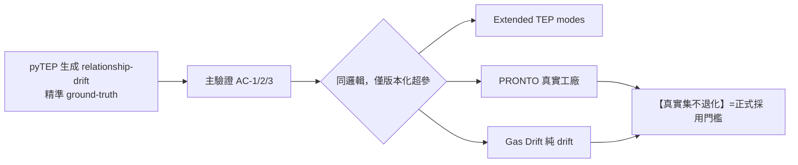

# 開發計畫 — Health_Index MVP

> 版本 **v0.2**（納入三方紅隊修正）· 日期 2026-06-02
> 上游：`requirements_spec.md` v0.2、`functional_design.md` v0.2；修正依據：`redteam_reconciliation.md`
> 紀律：綠燈才 commit（`[verified]`）；含 RNG 測試鎖 seed＋容忍帶；連 3 次同錯/regression/doom loop 自動 rollback。

---

## 1. 修訂里程碑（連續型 MVP，含全棧層）
| M | 里程碑 | 主要交付 | DoD | 依賴 |
|---|---|---|---|---|
| M0 | 骨架/環境 | venv、config.py（單一超參表）、interface.py 雙軌契約、.gitattributes、套件骨架、`.claude` hook 已就緒 | `pip install -e .`、import 通過、空測試綠 | — |
| M1 | 資料層 | TEP/pyTEP/PRONTO/Gas adapters→契約；**ruptures 切段＋穩態 gate**；transition/maintenance 排除 | adapter 對照官方欄位語意；TEP 切出已知穩態段 | M0 |
| M2 | L1 | sanity＋**FastMCD(固定 random_state)**＋DQI_x | 注入 NaN/凍結被擋；OOD 升高 | M1 |
| M3 | L2 | PCA→GSI/T²/SPE＋**block-bootstrap 控制限**＋**RBC**(caveat) | **Rule 9 核心測試：隱性多變量飄移被 SPE 抓、被逐變數圖漏**；RBC 對單故障定位、標多方向殘留 | M1 |
| M4 | L3 | GPR Ŷ＋可信度雙路(GSI/SFA/**ICAD**；**split-CP** 含最小 calibration 門檻)＋X→Y 對齊 | golden-A Ŷ 誤差低；OOD 可信度降；CP 僅在足量 Y 後上線 | M1,M3 |
| M5 | L4 | **KS first-pass→MMD**；1D-Wasserstein 量級；**對 null 標準化**；**block-permutation** | 換 mode 後漂移升、非重疊穩定；null type-I≈α | M3 |
| M6 | 融合/觸發 | 各分量→null 尾機率→加權→**單一決策點＋FWER**；re-entry 偵測 | AC-1/2/3＋**AC-6 golden-A 誤報率≤α** | M2-M5 |
| M7 | 後端 API | FastAPI 端點＋降級階梯 | API 整合測試 | M6 |
| M8 | 前端 Dash | HI 時間軸/T²·SPE·GSI/ŶvsY/**RBC 肇因/嚴重度帶/降級標示** | 手動點擊驗證(AC-5) | M7 |
| M9 | cross-validation | runner＋pytest(WHY)＋泛化報告 | **AC-4：同邏輯 ≥2 集滿足且真實集不退化** | M6 |
| M10 | 啟動手冊＋Demo | startup_manual.md＋walkthrough | 乾淨環境一次拉起全棧 | M8,M9 |

## 2. cross-validation 驗證策略（紅隊 D2 修正：oracle 不可循環）

- pyTEP 是合成 oracle → **正式採用須綁真實集(PRONTO/Gas)不退化**，非只看 pyTEP（避免循環論證）。
- **power 下限以 TEP 模擬 relationship-drift power curve 實證**（固定關係漂移幅度掃 n），**不套單變量均值位移公式**（紅隊 N1）。
- 超參只允許版本化、有理由的逐集差異；需大幅 per-dataset 調參才過＝過擬合 → surface。

## 3. 現代化採用準則（紅隊 H2，含出口條件）
- 現代法皆 **candidates**；**經典保留為 baseline 與 fallback**。
- 每 candidate 在 TEP A/B **≤ N 次**（避免無限 benchmark 拖延 MVP，Rule 2/4）；逾時則**保留經典基線、現代法降 P2**。
- A/B 的「改善」須對**正確的 alternative**（relationship/covariance 漂移，非均值位移）評估，測試集含「每變數在規格內的純多變量漂移」。
- 分階段：**P1**=DPCA/RBC/FastMCD/ruptures/split-CP(有 Y 時)/MMD-first-pass-KS；**P2**=SFA/CVA/ICAD/EnbPI·ACI/ADWIN·BOCPD/Isolation Forest；**P3**=DKL·SVGP/VAE/KPCA·ICA/GNN(遠期)。

## 4. 線上節拍與運算預算（紅隊 D3，新增）
- dev_plan 須先定：**線上窗大小 n、節拍上限、各 L4 指標 per-window 時間預算**。
- MMD permutation O(B·n²)、Sinkhorn O(n²/ε) 超預算 → 降採樣 PCA-score / 降級（MMD→KS、Sinkhorn→1D-W）並 surface（Rule 6）。

## 5. 超參治理（紅隊 D1）
單一 `config.py`：DPCA-lag / ruptures-penalty / MMD-bandwidth(或 MMDAgg kernel set) / Sinkhorn-ε / CP-α / perm-B / random_state；每項附 **TEP 掃描預設值 + 「勿動除非…」**；非預設才需人介入。

## 6. 啟動手冊（startup_manual.md，原生 venv，M10）
venv 建置 → 資料下載/授權 → 後端 `uvicorn` → 前端 `python frontend/app.py` → 健康檢查 → 煙霧測試 → FAQ（埠/路徑/版本/降級模式）。

## 7. 風險與緩解
| 風險 | 等級 | 緩解 |
|---|---|---|
| AVM-continuous 無前例 | 高 | 原創組合＋cross-validation＋真實集 |
| **FWER 破壞 golden-A 低分(AC-1)** | 高 | 單一決策點＋校正；AC-6 驗誤報率 |
| **超參總帳維運不可 own** | 中 | 單一 config＋掃描預設＋勿動說明 |
| A/B 合成 oracle 循環 | 中 | 綁真實集不退化 |
| RNG 致偽 regression 觸發 rollback | 中 | 鎖 seed＋容忍帶斷言＋CI seed 矩陣 |
| 自相關破壞控制限/permutation | 中 | block-bootstrap/KDE 限＋block-permutation |
| 時序 CP 保證失效 | 中 | 不宣稱保證、批次校準、GSI/ICAD 擔無標籤 |

## 8. 綠燈 commit 與 checkpoint
每 M 完成 checkpoint（做了/已驗證/還剩）；綠燈帶 `[verified]`；高風險改動進 `git worktree`；**commit 前 hook 提醒審核獨立性**（承載性結論需獨立紅隊）。

## 變更紀錄
- v0.2：里程碑方法選型按紅隊修正（FastMCD/RBC/block-bootstrap/ICAD/KS-first-pass/null 標準化/單一決策點+FWER）；新增 §2 真實集不退化、power curve；§3 A/B 出口條件＋正確 alternative；§4 線上節拍預算；§5 超參治理；§7 新增 FWER/超參/RNG/自相關風險。
