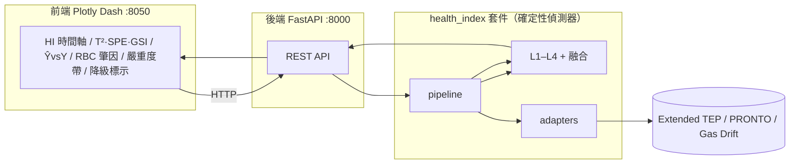
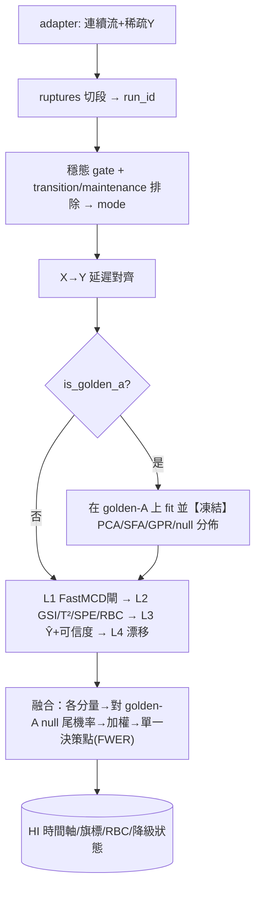

# 功能設計 — Health_Index MVP

> 版本 **v0.2**（納入三方紅隊修正）· 日期 2026-06-02
> 上游：`requirements_spec.md` v0.2；修正依據：`redteam_reconciliation.md`

---

## 1. 系統架構

偵測核心是純函式庫，可不經 HTTP 被 pytest / cross-validation 呼叫。

## 2. 套件結構
```
src/health_index/
├── interface.py        # 統一契約（雙軌：穩態 pseudo-run + 逐時刻 lagged）— 骨架穩定
├── config.py           # 單一 config：所有超參(lag/penalty/bandwidth/ε/α/B/seed) + TEP 掃描預設
├── adapters/           # tep / pronto / gas_drift
├── preprocess/         # ruptures 切段 + 穩態 gate / transition·maintenance / X→Y 對齊
├── detectors/
│   ├── dqi_x.py        # L1 sanity + FastMCD + DQI_x
│   ├── mspc.py         # L2 PCA→GSI/T²/SPE + RBC + block-bootstrap 控制限
│   ├── soft_sensor.py  # L3 GPR + 可信度(GSI/SFA/ICAD/split-CP)
│   └── drift.py        # L4 KS→MMD 分層 + 1D-Wasserstein + PSI + block-permutation
├── health.py           # 融合(對null標準化→加權)+ 單一決策點 + FWER + re-entry 觸發
├── fallback.py         # 降級階梯
├── validation/crossval.py
└── api/{server.py,schemas.py}
frontend/app.py
tests/                  # 編碼 WHY；RNG 測試鎖 seed + 容忍帶
```

## 3. 統一資料契約（雙軌 + 凍結基準）— 維持骨架
原始欄（adapter 提供）：`timestamp` / `x_<sensor>` / `grade_label` / `y_value`(多 NaN) / `y_timestamp`。
衍生欄（pipeline 算）：`campaign_id` / `mode`{steady,transition,maintenance} / `run_id` / `is_golden_a` / `y_delay`。
設定（不入列，TEP 掃描定值）：`x_lag_order` / `ssd_penalty` / `mmd_bandwidth` / `sinkhorn_eps` / `cp_alpha` / `perm_B` / `random_state`。

## 4. 處理管線

> **凍結原則（紅隊 N3）**：所有模型在 golden-A fit 後凍結；permutation 只重排樣本標籤、**不重估模型**，否則 null 偏樂觀。

## 5. REST API
| 方法 | 路徑 | 功能 | 實作狀態 |
|---|---|---|---|
| GET | /health | 健康檢查（煙霧端點）| ✅ M7 |
| GET | /datasets | 列資料集 | ✅ M7 |
| POST | /baseline | 以 golden-A 建並**凍結**基準（回 pca_k, null 分佈摘要, calib 規模）| ⏳ M-later |
| POST | /analyze | 跑判斷鏈 → AnalysisResult（per-campaign 彙總）| ✅ M7 |
| POST | /timeline | 逐樣本 T²/SPE/GSI + 控制限 + campaign 邊界 | ✅ B1 |
| POST | /contribution | per-campaign RBC 肇因 [{variable,rbc,spc_exceedance}] | ✅ B1 |
| POST | /crossval | 跨資料集驗證（含真實集不退化檢核）| ⏳ B2 |

> **命名偏離（B1，Rule 12）**：原訂 `GET /analyze/{job}/health`、`/analyze/{job}/contribution` 為有狀態（job store）。MVP 採**無狀態**（請求帶 seed/drift 重算、無 job 持久層），故實作為無路徑段的 `POST /timeline`、`POST /contribution`；待引入 job store 時再回 RESTful 子資源路徑。Ŷ vs Y 軟測量時間軸欄位仍待 L3 端點（M-later）。

## 6. L4 漂移偵測（重新設計，紅隊重點）
```
1. 空間：PCA 分數空間（捕捉關係型漂移）
2. first-pass：KS-on-score（解析 p-value、零 permutation/調參）— 廉價哨兵
3. 升級：KS 觸發 或 需多維敏感度 → MMD/MMDAgg（permutation；B、bandwidth 版本化）
4. 量級：解析 1D-Wasserstein on score（無 ε）；Sinkhorn 留待真需多維 OT 幾何
5. 標準化：所有量級/統計量先對 golden-A null 標準化（z over null），才可跨 campaign 比較
6. 校準：block-permutation（保短程自相關）；PSI 只算給人看、不入顯著性
7. 決策：不各自宣告 → 交融合層單一決策點 + FWER 控制
```

## 7. Health Index 融合與決策（紅隊 N2/N6）
- 各分量（T²/SPE/RBC-agg/漂移/可信度）先映射為**對 golden-A null 的尾機率或標準化分數**（同尺度、可比）。
- 加權成 0–1（1=健康）；權重在 TEP ground-truth 上校準並**驗單調性**（Rule 9）。
- **唯一告警決策點＝融合分數＋持續性閾值＋FWER 控制**；各 detector 僅作特徵與診斷，不獨立告警，避免多重比較膨脹破壞 AC-1。
- 方向統一：所有子分數「越高越健康」。

## 8. 可信度設計（紅隊 H1/C3）
| 情境 | 可信度來源 |
|---|---|
| 無標籤（多數時刻）| GSI/SFA 輸入域相似度 ＋ **ICAD**（免標籤 conformal p-value）|
| 有 lab-Y 且累積 ≥ 最小 calibration 門檻 | **split-CP** 預測區間 |
| 時序漂移 | **不宣稱 EnbPI/ACI 覆蓋保證**（re-entry 破前提）；僅批次校準 |
| 相容對照 | 保留 RI |

## 9. 降級階梯（FR-13）
CP→GSI／MMD→KS／Sinkhorn→1D-Wasserstein／FastMCD 失敗→sample cov+警示；UI 標「降級模式」。

## 10. 確定性與可解釋
超參全在 `config.py`；含 RNG 者鎖 seed＋記錄 B；UI 主訊息＝嚴重度帶＋RBC 肇因，數學量（MMD/p-value/Sinkhorn）當 tooltip。RBC 標「定位非因果、多方向殘留 smearing」。

## 公式依據
L1–L4 公式以 `avm_metrics_definitions.md` 為準（GSI=D²/p、T²/SPE、RBC=Alcala&Qin 2009、MMD=Gretton 2012、Sinkhorn=Genevay 2019、CP=Angelopoulos&Bates 2021）。

## 變更紀錄
- v0.2：L4 重設計（KS first-pass/1D-Wasserstein/標準化/block-permutation）、融合單一決策點+FWER、凍結模型原則、可信度雙路(GSI/ICAD/CP)、降級階梯、config 單一超參治理、RBC caveat 上 UI。
